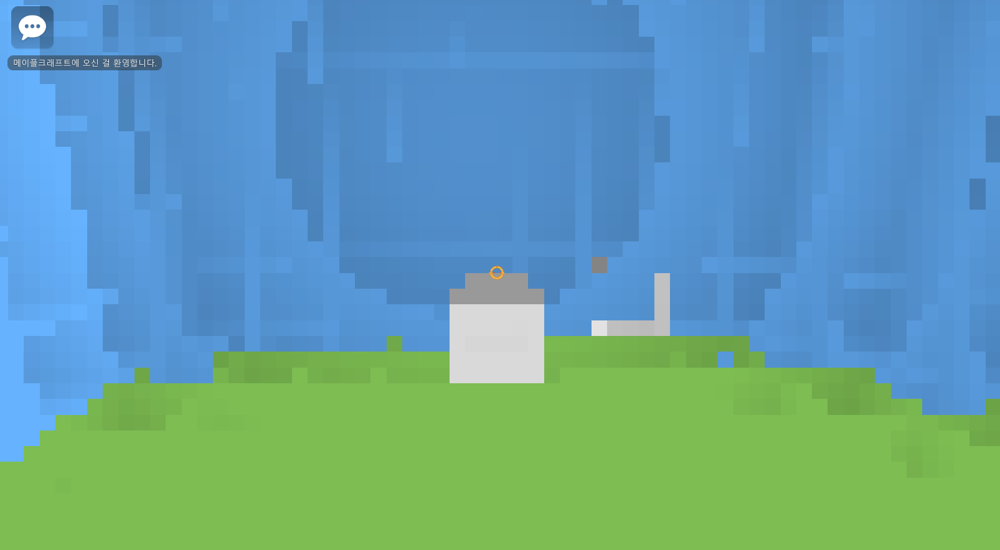
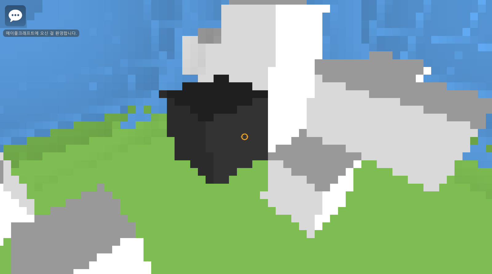

# 메이플크래프트 — 3D 레이캐스팅 렌더링

2D 전용 저작 툴인 MapleStory Worlds 위에서 3D DDA(Digital Differential Analyzer)
레이캐스팅 알고리즘을 직접 구현해, 64×36 저해상도 화면에 3차원 공간 렌더링과
복셀(블록) 설치·파괴 인터랙션을 구현한 실험적 프로젝트입니다.

| 항목 | 내용 |
|---|---|
| 개발 형태 | 1인 개발 |
| 개발 기간 | 2026.08 ~ 진행 중 (텍스처 매핑 등 추가 기능 개발 예정) |
| 개발 환경 | MapleStory Worlds, Lua |
| 플레이 | https://maplestoryworlds.nexon.com/ko/play/274f61b85c3f482f976977478f9a19d1/ |
| 데모 영상 | https://www.youtube.com/watch?v=X7FH1VWcZgQ&t=45s |

<br>

## 📸 스크린샷

| 화면 1 | 화면 2 |
|---|---|
|  |  |


<br>

## 🎮 주요 기능

- 3D DDA 알고리즘 기반 실시간 레이캐스팅 렌더링 (64×36 = 2,304 픽셀)
- 마우스 델타 입력 기반 Yaw/Pitch 시점 회전 및 카메라 좌표계 자체 구현
- 세로벽/천장·바닥/가로벽 방향별 셰이딩 + 지수 감쇠 안개 효과
- WASD 이동, 마우스 좌/우 클릭 기반 블록 설치·파괴 인터랙션
- UI 슬라이스(2,304개) 오브젝트 풀링으로 런타임 힙 할당 최소화

<br>

## 📁 저장소 안내

```
RaycastRenderer.xml   # MapleStory Worlds 컴포넌트 원본 파일 (에디터로 바로 임포트 가능)
RaycastRenderer.lua   # 위 XML 안의 Lua 코드만 모아 GitHub에서 읽기 쉽게 정리한 버전
```

MapleStory Worlds는 컴포넌트를 XML로 감싼 Lua 코드 블록 형태로 관리합니다.
`.xml` 파일이 실제로 에디터에 다시 불러올 수 있는 원본이고, `.lua` 파일은 같은
코드를 GitHub에서 문법 강조와 함께 보기 좋게 펼쳐놓은 버전입니다.

<br>

## 🔍 핵심 구현

### 1. 소수점 카메라 위치와 정수형 그리드 맵 간의 원근 계산

카메라 위치는 실수(float)인데 맵은 정수 그리드라서, 같은 칸 안에서도 위치에 따라
벽까지의 첫 충돌 거리가 달라야 합니다. 각 축의 소수부 위치를 기준으로 초기
`sideDist`를 개별 계산해 해결했습니다.

```lua
local sideDistX = (rayDirX * self.Pos.x > 0)
    and (1 - (math.abs(self.Pos.x) % 1)) * deltaX
    or  (math.abs(self.Pos.x) % 1) * deltaX
```

좌표축도 엔진이 정해주지 않아 맵 인덱스 증가 방향과 X/Y/Z 축 증가 방향을 직접
일치시켜 DDA 스텝 방향과 충돌 판정 기준을 통일했습니다.

### 2. 엔진이 제공하지 않는 3D 카메라 좌표계 직접 구축

MapleStory Worlds는 2D 전용 툴이라 3D 카메라 회전 개념이 없습니다. 마우스 델타로
Yaw/Pitch를 누적하고, 삼각함수로 Forward/Up 벡터를 계산한 뒤 외적으로 카메라
평면(PlaneX) 축을 구했습니다.

```lua
self.CameraForward.x = cosP * sinY
self.CameraForward.y = sinP
self.CameraForward.z = cosP * cosY

self.CameraUp.x = -sinP * sinY
self.CameraUp.y = cosP
self.CameraUp.z = -sinP * cosY

-- right (PlaneX) : Forward × Up 외적
self.PlaneX.x = self.CameraForward.y * self.CameraUp.z - self.CameraForward.z * self.CameraUp.y
self.PlaneX.y = self.CameraForward.z * self.CameraUp.x - self.CameraForward.x * self.CameraUp.z
self.PlaneX.z = self.CameraForward.x * self.CameraUp.y - self.CameraForward.y * self.CameraUp.x
```

### 3. 3차원 맵 데이터를 1차원 배열로 평탄화한 인덱싱 구조

Lua에서 3중 중첩 배열(`map[x][y][z]`)은 각 하위 테이블이 참조처럼 동작해 비효율적
입니다. 11×11×11 맵 전체를 1차원 배열로 평탄화하고 직접 인덱스를 계산했습니다.

```lua
hit = self.Map[mapIndexX + (mapIndexZ * self.MapSizeX) + (mapIndexY * self.MapSizeX * self.MapSizeZ) + 1]
```

### 4. 레이캐스팅 반복문 내 객체 힙 할당으로 인한 성능 저하 해결

매 프레임 2,304개의 광선을 순회하는 루프 안에서 색상 객체를 매번 생성하면 성능이
크게 떨어집니다. 색상 상수를 루프 진입 전에 미리 선언해두고, 루프 내부에서는
이미 풀링된 슬라이스의 색상 값만 갱신하도록 했습니다.

```lua
-- 루프 진입 전: 한 번만 생성
local COLOR_X = Vector4(1.0, 1.0, 1.0, 1)
local COLOR_Z = Vector4(0.85, 0.85, 0.85, 1)
...

-- 루프 내부: 새 객체 생성 없이 값만 대입
pixel.Color.r = COLOR_X.x * factor * forward
pixel.Color.g = COLOR_X.y * factor * forward
pixel.Color.b = COLOR_X.z * factor * forward
```

UI 슬라이스 2,304개 자체도 `OnBeginPlay` 시점에 `InitSlicePool`로 미리 생성해두고,
매 프레임은 이미 만들어진 슬라이스의 색상만 갱신합니다.
